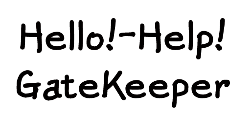

# 메세지 전달형 자살 예방 웹사이트




```
우울증 예방을 위한 센터 정보와 테스트, 사람들의 응원메시지를 제공하는 웹사이트입니다.
```

## 주요 기술 스택

|Subject|Stack|
|:---|:---|
 |View|  |
 |State Management||
 |CSS||
 |Code Quality| |
 |Design Tool| |
 |Server||


## 사이트 URL

- ### https://suicideprevent-101dc.web.app/


## 개발 기간

- ### 2023.07 ~ 2023.09


## 주요 기능

- 센터 정보 : 어려운 상황에 필요한 센터의 위치와 연락처 정보 제공

- 우울증 테스트: 심리 상태 평가 및 우울증 여부 확인을 위한 테스트 제공

- 응원 메시지: 긍정적인 에너지와 공감을 나눌 수 있는 응원 메시지 공간

- 게시판 : 마음이 힘들 사람들과 함께 서로 정보나 글을 공유하며 힘이 되는 공간 


